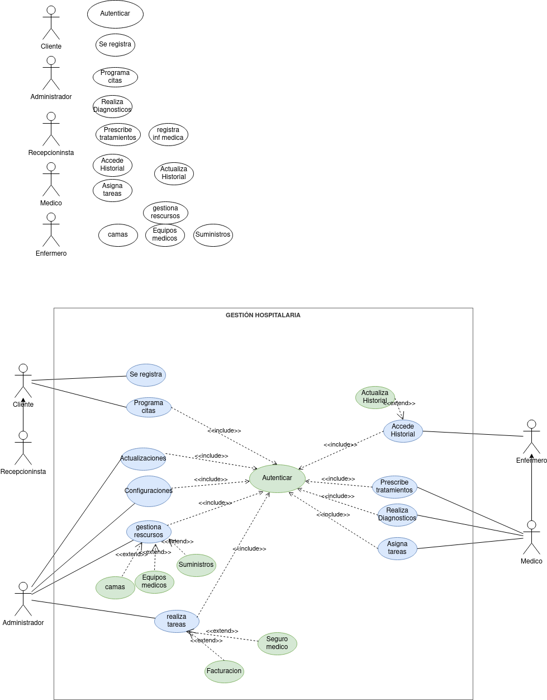

<h1>Ejercicio de  casos de Usos</h1>

Adonay González Gutiérrez

<h2>Indice</h2>

- [Ejercicio](#ejercicio)
- [Diagrama](#diagrama)
- [Especificacion Actores](#especificacion-actores)
  - [Paciente](#paciente)
  - [Recepcionista](#recepcionista)
  - [Administrador](#administrador)
  - [Enfermero](#enfermero)
  - [Medico](#medico)
- [Especificación Casos de Uso](#especificación-casos-de-uso)
  - [Se registra](#se-registra)
  - [Programa Citas](#programa-citas)

## Ejercicio
Sistema de Gestión Hospitalaria

El sistema de gestión hospitalaria tiene como objetivo mejorar la eficiencia y coordinación de los procesos dentro de un hospital. En el sistema participan distantas personas, como son: Paciente, Médico, Enfermero, Administrador del Sistema y Recepcionista. A continuación, se presentan algunos casos de uso para este sistema:

**La información que se posee de cada uno de ellos es la siguiente:**

- Paciente: Un individuo que busca servicios médicos en el hospital.
- Médico: Profesional médico encargado de diagnosticar y tratar a los pacientes.
- Enfermero: Encargado de asistir a los médicos y cuidar a los pacientes.
- Administrador del Sistema: Responsable de la configuración y administración del sistema.
- Recepcionista: Encargado de la recepción de pacientes y asignación de citas.

**Las acciones que se realizarán en el sistema son las que siguen:**

- El paciente se registra en el sistema proporcionando información personal y médica.
- El paciente o la recepcionista programa citas médicas para los pacientes. (Debe autenticado)
- El médico realiza diagnósticos, prescribe tratamientos y registra la información médica del paciente.(Debe autenticado)
- El médico y el enfermero pueden acceder y actualizar el historial médico del paciente.(Debe autenticado)
- El médico asigna tareas específicas a los enfermeros relacionadas con la atención del paciente.(Debe autenticado)
- El administrador del sistema realiza configuraciones y actualizaciones del sistema.(Debe autenticado)
- El personal administrativo realiza tareas relacionadas con la facturación y el procesamiento del seguro médico.(Debe autenticado)
- El administrador del sistema gestiona los recursos hospitalarios, como camas, equipos médicos y suministros.(Debe autenticado)

## Diagrama

## Especificacion Actores

### Paciente
|  Actor | Paciente |
|---|---|
| Descripción  | Persona que busca servicios medicos|
| Características  |  |
| Relaciones | se relaciona con el recepcionista, el enfermero y el medico  |
| Referencias |Se registra en el sistema, programa citas, debe autenticarse|   
|  Notas |  _ |
| Autor  | Adonay Gonzalez Gutierrez |
|Fecha | 2023-11-15 |

### Recepcionista

|  Actor | Recepcionista |
|---|---|
| Descripción  | Encargado de recibir a los clientes y asignar citas  |
| Características  ||
| Relaciones | Se relaciona con el cliente   |
| Referencias |Programa citas y debe autenticarse|   
|  Notas |No las hay|
| Autor  | Adonay González Gutiérrez |
|Fecha | 2023-11-15|

### Administrador
|  Actor | Administrador |
|---|---|
| Descripción  | Responsable de la Configuracion del sistema  |
| Características  |  |
| Relaciones | no se relaciona con el resto de Actores |
| Referencias | Actulizaciones y configuracion de sistema, gestiona rescursos ( camas, equipos medicos, suministros), realizatareas de facturacion y de seguros medicos |   
|  Notas |  |
| Autor  | Adonay González Gutiérrez |
|Fecha | 2023-11-15|

### Enfermero
|  Actor | Enfermero |
|---|---|
| Descripción  | Encargados de asisitir a los medicos y cuidar a los pasientes |
| Características  |  |
| Relaciones | realiza las tareas asignadas por los medicos, cuida los pacientes   |
| Referencias | accede al historial, actualiza historial, debe autenticarse. |   
|  Notas |  |
| Autor  | Adonay González Gutiérrez |
|Fecha | 2023-11-15|

### Medico 
|  Actor | Medico |
|---|---|
| Descripción  | Profesional encargado de diagnosticar y tratar a los pacientes  |
| Características  |  |
| Relaciones | diagnostica y trata a los pacientes, asigna tareas a los enfermeros y pueden acceder al historial medico del paciente y actualizar sus datos |
| Referencias | diagnostica y trata, actualiza historial, asigna tareas, debe atenticarse |   
|  Notas |   |
| Autor  | Adonay González Gutiérrez |
|Fecha | 2023-11-15|

## Especificación Casos de Uso

### Se registra
 |  Caso de Uso	CU | Se registra  |
  |---|---|
  | Fuentes  | [Ejercicio](#ejercicio) |
  | Actor  |  Paciente |
  | Descripción | Registr sus datos en el sistema  |
  | Flujo básico | |
  | Pre-condiciones |  |  
  | Post-condiciones  | |  
  |  Requerimientos |   |
  |  Notas |  _Notas adicionales_ |
  | Autor  | Adonay González Gutiérrez |
  |Fecha | 2023-11-15 |

### Programa Citas
   |  Caso de Uso	CU | Programa Citas |
  |---|---|
  | Fuentes  |  [Ejercicio](#ejercicio) |
  | Actor  | El Cliente y el Recepcionista |
  | Descripción | El cliente o el recepcionista programan una cita   |
  | Flujo básico | _Descripción paso a paso de la ejecución. (1->2->3.)_ |
  | Pre-condiciones |  |  
  | Post-condiciones  |  |  
  |  Requerimientos | Autenticar |
  |  Notas |  _Notas adicionales_ |
  | Autor  | Adonay González Gutiérrez |
  |Fecha | 2023-11-15 |

   |  Caso de Uso	CU | XXX  |
  |---|---|
  | Fuentes  | [Ejercicio](#ejercicio) |
  | Actor  |  _Actores que participan en el caso de uso_ |
  | Descripción | _Descripción del caso de uso_  |
  | Flujo básico | _Descripción paso a paso de la ejecución. (1->2->3.)_ |
  | Pre-condiciones | _Que debe ocurrir con anterioridad_  |  
  | Post-condiciones  | _Que debe ocurrir con posterioridad_  |  
  |  Requerimientos | _Que debe de exister para que el caso de uso se ejecute. Ej: Tarjeta de crédito_  |
  |  Notas |  _Notas adicionales_ |
  | Autor  | Adonay González Gutiérrez|
  |Fecha | 2023-11-15 |

   |  Caso de Uso	CU | XXX  |
  |---|---|
  | Fuentes  | [Ejercicio](#ejercicio)  |
  | Actor  |  _Actores que participan en el caso de uso_ |
  | Descripción | _Descripción del caso de uso_  |
  | Flujo básico | _Descripción paso a paso de la ejecución. (1->2->3.)_ |
  | Pre-condiciones | _Que debe ocurrir con anterioridad_  |  
  | Post-condiciones  | _Que debe ocurrir con posterioridad_  |  
  |  Requerimientos | _Que debe de exister para que el caso de uso se ejecute. Ej: Tarjeta de crédito_  |
  |  Notas |  _Notas adicionales_ |
  | Autor  | Adonay González Gutiérrez |
  |Fecha | 2023-11-15 |

   |  Caso de Uso	CU | XXX  |
  |---|---|
  | Fuentes  |[Ejercicio](#ejercicio)  |
  | Actor  |  _Actores que participan en el caso de uso_ |
  | Descripción | _Descripción del caso de uso_  |
  | Flujo básico | _Descripción paso a paso de la ejecución. (1->2->3.)_ |
  | Pre-condiciones | _Que debe ocurrir con anterioridad_  |  
  | Post-condiciones  | _Que debe ocurrir con posterioridad_  |  
  |  Requerimientos | _Que debe de exister para que el caso de uso se ejecute. Ej: Tarjeta de crédito_  |
  |  Notas |  _Notas adicionales_ |
  | Autor  | Adonay González Gutiérrez |
  |Fecha | 2023-11-15 |

   |  Caso de Uso	CU | XXX  |
  |---|---|
  | Fuentes  | [Ejercicio](#ejercicio)  |
  | Actor  |  _Actores que participan en el caso de uso_ |
  | Descripción | _Descripción del caso de uso_  |
  | Flujo básico | _Descripción paso a paso de la ejecución. (1->2->3.)_ |
  | Pre-condiciones | _Que debe ocurrir con anterioridad_  |  
  | Post-condiciones  | _Que debe ocurrir con posterioridad_  |  
  |  Requerimientos | _Que debe de exister para que el caso de uso se ejecute. Ej: Tarjeta de crédito_  |
  |  Notas |  _Notas adicionales_ |
  | Autor  | Adonay González Gutiérrez |
  |Fecha | 2023-11-15 |

   |  Caso de Uso	CU | XXX  |
  |---|---|
  | Fuentes  | [Ejercicio](#ejercicio) |
  | Actor  |  _Actores que participan en el caso de uso_ |
  | Descripción | _Descripción del caso de uso_  |
  | Flujo básico | _Descripción paso a paso de la ejecución. (1->2->3.)_ |
  | Pre-condiciones | _Que debe ocurrir con anterioridad_  |  
  | Post-condiciones  | _Que debe ocurrir con posterioridad_  |  
  |  Requerimientos | _Que debe de exister para que el caso de uso se ejecute. Ej: Tarjeta de crédito_  |
  |  Notas |  _Notas adicionales_ |
  | Autor  |Adonay González Gutiérrez |
  |Fecha | 2023-11-15 |

   |  Caso de Uso	CU | XXX  |
  |---|---|
  | Fuentes  | [Ejercicio](#ejercicio)  |
  | Actor  |  _Actores que participan en el caso de uso_ |
  | Descripción | _Descripción del caso de uso_  |
  | Flujo básico | _Descripción paso a paso de la ejecución. (1->2->3.)_ |
  | Pre-condiciones | _Que debe ocurrir con anterioridad_  |  
  | Post-condiciones  | _Que debe ocurrir con posterioridad_  |  
  |  Requerimientos | _Que debe de exister para que el caso de uso se ejecute. Ej: Tarjeta de crédito_  |
  |  Notas |  _Notas adicionales_ |
  | Autor  | Adonay González Gutiérrez |
  |Fecha | 2023-11-15 |

   |  Caso de Uso	CU | XXX  |
  |---|---|
  | Fuentes  | [Ejercicio](#ejercicio) |
  | Actor  |  _Actores que participan en el caso de uso_ |
  | Descripción | _Descripción del caso de uso_  |
  | Flujo básico | _Descripción paso a paso de la ejecución. (1->2->3.)_ |
  | Pre-condiciones | _Que debe ocurrir con anterioridad_  |  
  | Post-condiciones  | _Que debe ocurrir con posterioridad_  |  
  |  Requerimientos | _Que debe de exister para que el caso de uso se ejecute. Ej: Tarjeta de crédito_  |
  |  Notas |  _Notas adicionales_ |
  | Autor  | Adonay González Gutiérrez |
  |Fecha | 2023-11-15 |

   |  Caso de Uso	CU | XXX  |
  |---|---|
  | Fuentes  | [Ejercicio](#ejercicio) |
  | Actor  |  _Actores que participan en el caso de uso_ |
  | Descripción | _Descripción del caso de uso_  |
  | Flujo básico | _Descripción paso a paso de la ejecución. (1->2->3.)_ |
  | Pre-condiciones | _Que debe ocurrir con anterioridad_  |  
  | Post-condiciones  | _Que debe ocurrir con posterioridad_  |  
  |  Requerimientos | _Que debe de exister para que el caso de uso se ejecute. Ej: Tarjeta de crédito_  |
  |  Notas |  _Notas adicionales_ |
  | Autor  | Adonay González Gutiérrez |
  |Fecha | 2023-11-15 |

   |  Caso de Uso	CU | XXX  |
  |---|---|
  | Fuentes  | [Ejercicio](#ejercicio)  |
  | Actor  |  _Actores que participan en el caso de uso_ |
  | Descripción | _Descripción del caso de uso_  |
  | Flujo básico | _Descripción paso a paso de la ejecución. (1->2->3.)_ |
  | Pre-condiciones | _Que debe ocurrir con anterioridad_  |  
  | Post-condiciones  | _Que debe ocurrir con posterioridad_  |  
  |  Requerimientos | _Que debe de exister para que el caso de uso se ejecute. Ej: Tarjeta de crédito_  |
  |  Notas |  _Notas adicionales_ |
  | Autor  | Adonay González Gutiérrez |
  |Fecha | 2023-11-15 |

   |  Caso de Uso	CU | XXX  |
  |---|---|
  | Fuentes  | [Ejercicio](#ejercicio)  |
  | Actor  |  _Actores que participan en el caso de uso_ |
  | Descripción | _Descripción del caso de uso_  |
  | Flujo básico | _Descripción paso a paso de la ejecución. (1->2->3.)_ |
  | Pre-condiciones | _Que debe ocurrir con anterioridad_  |  
  | Post-condiciones  | _Que debe ocurrir con posterioridad_  |  
  |  Requerimientos | _Que debe de exister para que el caso de uso se ejecute. Ej: Tarjeta de crédito_  |
  |  Notas |  _Notas adicionales_ |
  | Autor  | Adonay González Gutiérrez |
  |Fecha | 2023-11-15 |

   |  Caso de Uso	CU | XXX  |
  |---|---|
  | Fuentes  | [Ejercicio](#ejercicio)  |
  | Actor  |  _Actores que participan en el caso de uso_ |
  | Descripción | _Descripción del caso de uso_  |
  | Flujo básico | _Descripción paso a paso de la ejecución. (1->2->3.)_ |
  | Pre-condiciones | _Que debe ocurrir con anterioridad_  |  
  | Post-condiciones  | _Que debe ocurrir con posterioridad_  |  
  |  Requerimientos | _Que debe de exister para que el caso de uso se ejecute. Ej: Tarjeta de crédito_  |
  |  Notas |  _Notas adicionales_ |
  | Autor  | Adonay González Gutiérrez |
  |Fecha | 2023-11-15 |

   |  Caso de Uso	CU | XXX  |
  |---|---|
  | Fuentes  | [Ejercicio](#ejercicio)  |
  | Actor  |  _Actores que participan en el caso de uso_ |
  | Descripción | _Descripción del caso de uso_  |
  | Flujo básico | _Descripción paso a paso de la ejecución. (1->2->3.)_ |
  | Pre-condiciones | _Que debe ocurrir con anterioridad_  |  
  | Post-condiciones  | _Que debe ocurrir con posterioridad_  |  
  |  Requerimientos | _Que debe de exister para que el caso de uso se ejecute. Ej: Tarjeta de crédito_  |
  |  Notas |  _Notas adicionales_ |
  | Autor  | Adonay González Gutiérrez |
  |Fecha | 2023-11-15 |

   |  Caso de Uso	CU | XXX  |
  |---|---|
  | Fuentes  | [Ejercicio](#ejercicio) |
  | Actor  |  _Actores que participan en el caso de uso_ |
  | Descripción | _Descripción del caso de uso_  |
  | Flujo básico | _Descripción paso a paso de la ejecución. (1->2->3.)_ |
  | Pre-condiciones | _Que debe ocurrir con anterioridad_  |  
  | Post-condiciones  | _Que debe ocurrir con posterioridad_  |  
  |  Requerimientos | _Que debe de exister para que el caso de uso se ejecute. Ej: Tarjeta de crédito_  |
  |  Notas |  _Notas adicionales_ |
  | Autor  | Adonay González Gutiérrez |
  |Fecha | 2023-11-15 |