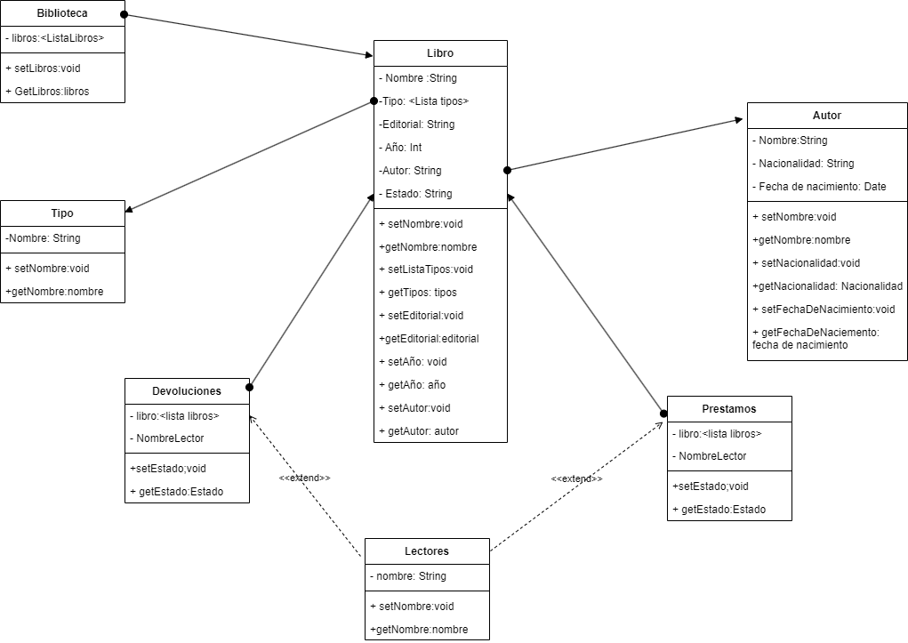
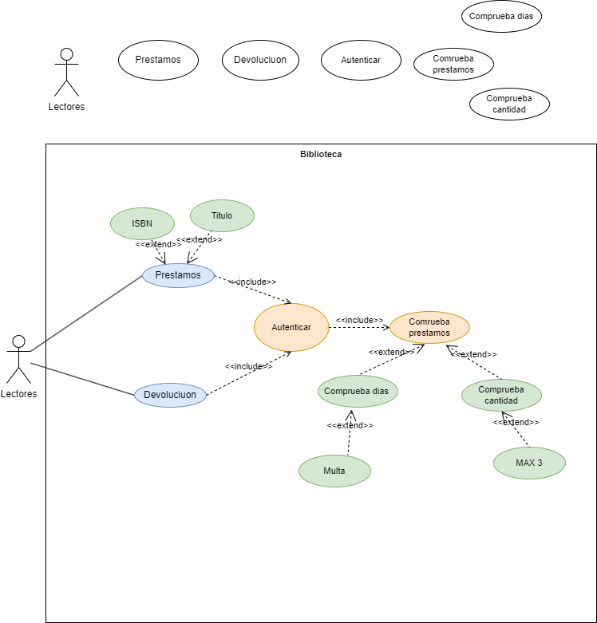

<h1>Ejercicio  Diagrama de clases/Diagrama de casos de usos</h1>

Adonay Gonzalez Gutierrez

<h2>Indice</h2>

- [Ejercicio](#ejercicio)
- [Diagrama de Clases](#diagrama-de-clases)
- [Diagrama de casos de uso](#diagrama-de-casos-de-uso)
- [Especificacion](#especificacion)
  - [Especificaion de autores](#especificaion-de-autores)
  - [Epecificacion de casos de uso](#epecificacion-de-casos-de-uso)

## Ejercicio 

- Una biblioteca tiene copias de libros. Estos últimos se caracterizan por su nombre, tipo (ingeniería, literatura, informática, historia ...), editorial, año y autor.
- Los autores se caracterizan por su nombre, nacionalidad y fecha de nacimiento.
- Cada copia tiene un identificador, y puede estar en la biblioteca, prestada, con retraso o en reparación.
- Los lectores pueden tener un máximo de 3 libros en préstamo.
- Cada libro se presta un máximo de 30 días, y por cada día de retraso, se impone una “multa” de dos días sin posibilidad de coger un nuevo libro.
- Realiza un diagrama de clases y añade los métodos necesarios para realizar el préstamo y devolución de libros. Realiza un diagrama de casos de usos.

## Diagrama de Clases

## Diagrama de casos de uso

## Especificacion

### Especificaion de autores

|  Actor | Lector |
|---|---|
| Descripción  | Persona que alquila libros|
| Características  |  |
| Relaciones |   |
| Referencias |Se autentica en el sistema, alquila y devuleve libros|   
|  Notas |  _ |
| Autor  | Adonay Gonzalez Gutierrez |
|Fecha | 2023-12-03 |

|  Atributos | Tipo |
|---|---|
| No conocidos | |
| Autor  | Adonay Gonzalez Gutierrez |
|Fecha | 2023-12-03 |

### Epecificacion de casos de uso

|  Caso de Uso	CU | Autenticarse  |
  |---|---|
  | Fuentes  | [Ejercicio](#ejercicio) |
  | Actor  |  Lectores |
  | Descripción | Se autentica en el sistema de la biblioteca |
  | Flujo básico | |
  | Pre-condiciones |  |  
  | Post-condiciones  | |  
  |  Requerimientos |   |
  |  Notas |  _Notas adicionales_ |
  | Autor  | Adonay González Gutiérrez |
  |Fecha | 2023-12-03 |

 |   Caso de Uso	CU | Prestamo  |
  |---|---|
  | Fuentes  | [Ejercicio](#ejercicio) |
  | Actor  |  Lectores |
  | Descripción | Pide prestamos de libros |
  | Flujo básico | |
  | Pre-condiciones | no tener mas de 2 libros en prestamos y no tener multa activa  |  
  | Post-condiciones  | |  
  |  Requerimientos |  Autenticarse |
  |  Notas |  _Notas adicionales_ |
  | Autor  | Adonay González Gutiérrez |
  |Fecha | 2023-12-03 |

  |   Caso de Uso	CU | Devolucion  |
  |---|---|
  | Fuentes  | [Ejercicio](#ejercicio) |
  | Actor  |  Lectores |
  | Descripción | devulve los libros pretados |
  | Flujo básico | |
  | Pre-condiciones | tener algun libro en prestamo |  
  | Post-condiciones  | Si pasaron mas de 30 dias, recibe multa|  
  |  Requerimientos |  Autenticarse |
  |  Notas |  _Notas adicionales_ |
  | Autor  | Adonay González Gutiérrez |
  |Fecha | 2023-12-03 |

  |   Caso de Uso	CU | Comprobacion de prestamos Activos  |
  |---|---|
  | Fuentes  | [Ejercicio](#ejercicio) |
  | Actor  | Sistema(no es un actor)|
  | Descripción | comprueba si hay prestamos|
  | Flujo básico | |
  | Pre-condiciones | autenticarse|  
  | Post-condiciones  | en caso de que hayan prestamos, comprueba la cantidad y la cantidad de dias de cada uno de ellos|  
  |  Requerimientos |  Autenticarse |
  |  Notas |  _Notas adicionales_ |
  | Autor  | Adonay González Gutiérrez |
  |Fecha | 2023-12-03 |

  |   Caso de Uso	CU | Comprobacion de dias  |
  |---|---|
  | Fuentes  | [Ejercicio](#ejercicio) |
  | Actor  | Sistema(no es un actor)|
  | Descripción | comprueba la cantidad de dias qeu lleva prestado un libro|
  | Flujo básico | |
  | Pre-condiciones | haber comprobado que hay libros prestados a ese lector|  
  | Post-condiciones  | si no ha superdado los 30 dias no tendra multa, en el caso contrario tendra multa|  
  |  Requerimientos |  Autenticarse |
  |  Notas |  _Notas adicionales_ |
  | Autor  | Adonay González Gutiérrez |
  |Fecha | 2023-12-03 |

  |   Caso de Uso	CU | Comprobacion de cantidad  |
  |---|---|
  | Fuentes  | [Ejercicio](#ejercicio) |
  | Actor  | Sistema(no es un actor)|
  | Descripción | comprueba cantidad de prestamos activos|
  | Flujo básico | |
  | Pre-condiciones | hcomprobar que hay prestamos activos|  
  | Post-condiciones  | en caso de que hayan prestamos, comprueba la cantidad de ellos y si son mas de el MAX"3" no podra hacer prestamo|  
  |  Requerimientos |  Autenticarse |
  |  Notas |  _Notas adicionales_ |
  | Autor  | Adonay González Gutiérrez |
  |Fecha | 2023-12-03 |