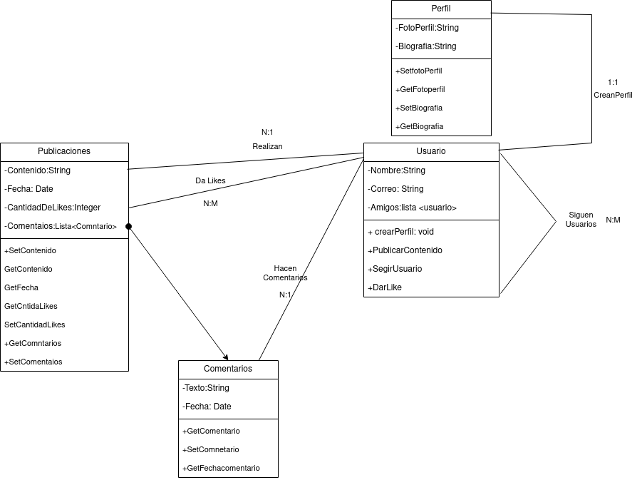

<h1>Examen Diagrama de Clases</h1>

Adonay González Gutiérrez

<h2>Indice</h2>

- [Ejercicio1](#ejercicio1)
  - [Diagrama de Clases.](#diagrama-de-clases)
  - [Psudocodigo](#psudocodigo)
- [Ejercicio2](#ejercicio2)
  - [Diagrama de clases](#diagrama-de-clases-1)
  - [Pseudocodigo](#pseudocodigo)
- [Enlace Repositorio](#enlace-repositorio)

# Ejercicio1

## Diagrama de Clases.

## Psudocodigo
El usuario es la princiapal clase aqui que realizar llamadas al resto de clases, se puede crear un perfil sinedo unico ya que va asociado a un correo por eso la cardinalidad "1:1", da likes a otras publicaciones,  hace comentarios y publicaciones estas contienen una lista comentarios y la cantidad de likes y por ultimo pueden segir a otros usuarios, esta es reflexiba.

# Ejercicio2

## Diagrama de clases 

## Pseudocodigo
En este ejercicio como en el anterior el usuario es la clase princiapal, gestiuna su perfil, cardinalidad 1,1 ya que solo tiene un perfil y solo puede ser gestionado por si mismo, realiza reservas, culaquier cantidad de ellas, el usuario tendra una lista de reservas lo que hara mas facil la busqueda de una en concreta, tambien puede vizualizar informacion, decidi darle una clase propia ya que posea la lista de aerolineas y aeropuertos como atributosy por ultimo busca vuelos, que poseen la informacion necesaria  y una instancia a la clase aerolinea qeu es la cual va a dar ese vuelo. 
Las clases aerolinea y aeropuerto tienden dentro de ellas una agrupacion de vuelo.

# Enlace Repositorio

<link href="https://github.com/adogonz23/ETS/tree/main/ExamenDiagramaClass">Enlace</link>

