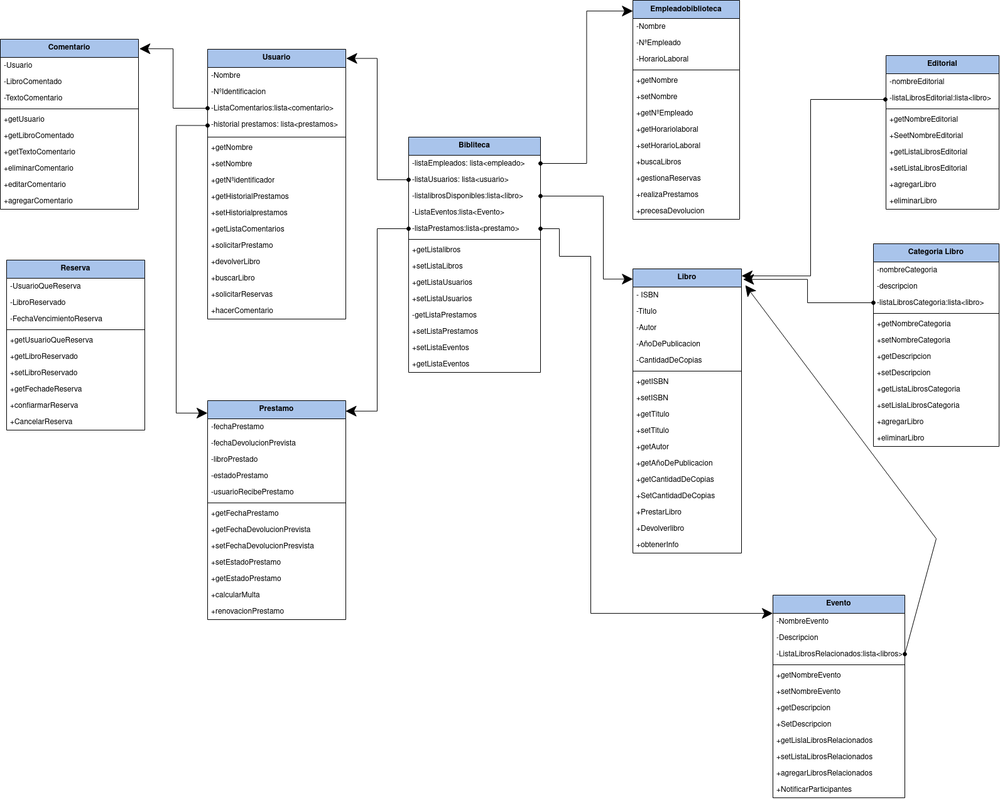

<h1> Proyecto App Gestion Bibiloteca </h1>

<h2>Documentancion sobre las diagramas de Casos de usos y Diagrama de clases</h2>

<h2>Indice</h2>

- [Enunciado](#enunciado)
- [Diagrama de Cados de Uso](#diagrama-de-cados-de-uso)
- [Especificacion Actores](#especificacion-actores)
  - [Usuario](#usuario)
  - [Bibliotecario](#bibliotecario)
- [Especificacion de casos de uso](#especificacion-de-casos-de-uso)
  - [Busca libros](#busca-libros)
  - [Devuelve libro](#devuelve-libro)
  - [Deja Comentario](#deja-comentario)
  - [Selecciona Categoria](#selecciona-categoria)
  - [Selecciona libro](#selecciona-libro)
  - [Realiza prestamos](#realiza-prestamos)
  - [Procesa Informacion](#procesa-informacion)
  - [Gestiona Reservas](#gestiona-reservas)
  - [Vizualiza info](#vizualiza-info)
  - [Modifica Informacion](#modifica-informacion)
  - [Registra Usuario](#registra-usuario)
  - [Agrega libros](#agrega-libros)
- [Diagrama de Clases](#diagrama-de-clases)
- [Clases](#clases)
  - [Usuario](#usuario-1)
  - [Bibliotecario](#bibliotecario-1)
  - [Biblioteca](#biblioteca)
  - [Libro](#libro)
  - [CategoriaLibro](#categorialibro)
  - [Cometario](#cometario)
  - [Reserva](#reserva)
  - [Evento](#evento)
  - [Editorial](#editorial)
- [Conclucion Clases](#conclucion-clases)

## Enunciado

Desarrolla un sistema de llamado Gestión de Biblioteca que permita a los bibliotecarios buscar, prestar y devolver libros en una biblioteca. El sistema debe tener una interfaz de usuario simple (Main con menú) y proporcionar funcionalidades básicas de administración de libros, como: (obtenerInformacion (identificadorLibro),prestarLibro(identificadorLibro),devolverLibro(identificadorLibro),agregarComentario(identificadorLibro),consultarComentarios(identificadorLibro),verificarDisponibilidad(identificadorLibro)). Además el sistema permitirá dar de alta/modificación/búsqueda/eliminación de usuarios y libros.

Teniendo en cuenta lo anterior, nuestro sistema debe contemplar trabajar con la siguiente información:

***<a href="https://github.com/jpexposito/docencia/tree/master/Primero/ETS/PROYECTO">Acceso a la información</a>***

## Diagrama de Cados de Uso

## Especificacion Actores

### Usuario

  Actor | Usuario |
|---|---|
| Descripción  | Persona que usa los recursos la bibloteca|
| Características  |  |
| Relaciones | se relaciona con el bibliotecario  |
| Referencias |Busca libros, selecciona libro, devuelve libro, deja comentarios, seleciona categorias|   
|  Notas |  _ |
| Autor  | Adonay Gonzalez Gutierrez |
|Fecha | 2024-01-16 |

### Bibliotecario

 Actor | Bibliotecario |
|---|---|
| Descripción  | Persona que trabaja en la biblioteca|
| Características  |  |
| Relaciones | se relaciona con el usuario  |
| Referencias |Gestiona datos de usuarios(da de alta, dar de baja etc), realiza prestamos,gestiona reservas, agrega nuevos libros, procesa devoluciones|   
|  Notas |  _ |
| Autor  | Adonay Gonzalez Gutierrez |
|Fecha | 2024-01-16 |

## Especificacion de casos de uso

### Busca libros
 |  Caso de Uso	CU | Busca libros |
  |---|---|
  | Fuentes  | <a href="https://github.com/jpexposito/docencia/tree/master/Primero/ETS/PROYECTO">***Enlace***</a> |
  | Actor  |  Usuario|
  | Descripción | Busca libros en el sistema de la biblioteca  |
  | Flujo básico | |
  | Pre-condiciones |  |  
  | Post-condiciones  | |  
  |  Requerimientos |   |
  |  Notas |  _Notas adicionales_ |
  | Autor  | Adonay González Gutiérrez |
  |Fecha | 2024-01-16 |

  ### Devuelve libro
 |  Caso de Uso	CU | Devuelve Libro  |
  |---|---|
  | Fuentes  | <a href="https://github.com/jpexposito/docencia/tree/master/Primero/ETS/PROYECTO">***Enlace***</a> |
  | Actor  |  Usuario|
  | Descripción | Usuario devuelve el libro  |
  | Flujo básico | |
  | Pre-condiciones |  |  
  | Post-condiciones  | |  
  |  Requerimientos |   |
  |  Notas |  _Notas adicionales_ |
  | Autor  | Adonay González Gutiérrez |
  |Fecha | 2024-01-16 |

  ### Deja Comentario
 |  Caso de Uso	CU | Deja Comentario |
  |---|---|
  | Fuentes  | <a href="https://github.com/jpexposito/docencia/tree/master/Primero/ETS/PROYECTO">***Enlace***</a> |
  | Actor  |  Usuario|
  | Descripción | Usuario deja un comentario de un lirbo, el cual no tieno porque haberlo leido |
  | Flujo básico | |
  | Pre-condiciones |  |  
  | Post-condiciones  | |  
  |  Requerimientos |   |
  |  Notas |  _Notas adicionales_ |
  | Autor  | Adonay González Gutiérrez |
  |Fecha | 2024-01-16 |

  ### Selecciona Categoria
 |  Caso de Uso	CU | Selecciona Categoria |
  |---|---|
  | Fuentes  | <a href="https://github.com/jpexposito/docencia/tree/master/Primero/ETS/PROYECTO">***Enlace***</a> |
  | Actor  |  Usuario|
  | Descripción | el usuario selecciona una categoria pra filtrar la busqueda  |
  | Flujo básico | |
  | Pre-condiciones | iniciar la busqeuda de libros |  
  | Post-condiciones  | |  
  |  Requerimientos |   |
  |  Notas |  _Notas adicionales_ |
  | Autor  | Adonay González Gutiérrez |
  |Fecha | 2024-01-16 |

  ### Selecciona libro
 |  Caso de Uso	CU | Selecciona libro  |
  |---|---|
  | Fuentes  | <a href="https://github.com/jpexposito/docencia/tree/master/Primero/ETS/PROYECTO">***Enlace***</a> |
  | Actor  |  Usuario|
  | Descripción | El usuario selecciona el libro deseado |
  | Flujo básico | |
  | Pre-condiciones |  |  
  | Post-condiciones  | |  
  |  Requerimientos |   |
  |  Notas |  _Notas adicionales_ |
  | Autor  | Adonay González Gutiérrez |
  |Fecha | 2024-01-16 |

  ### Realiza prestamos
 |  Caso de Uso	CU |  Realiza Prestamos|
  |---|---|
  | Fuentes  | <a href="https://github.com/jpexposito/docencia/tree/master/Primero/ETS/PROYECTO">***Enlace***</a> |
  | Actor  |  Empleado|
  | Descripción | El empleado realiza los prestamos  |
  | Flujo básico | |
  | Pre-condiciones | el usuario debe seleccionar un libro |  
  | Post-condiciones  | |  
  |  Requerimientos |   |
  |  Notas |  _Notas adicionales_ |
  | Autor  | Adonay González Gutiérrez |
  |Fecha | 2024-01-16 |

  ### Procesa Informacion
 |  Caso de Uso	CU | Procesa Infomarcion  |
  |---|---|
  | Fuentes  | <a href="https://github.com/jpexposito/docencia/tree/master/Primero/ETS/PROYECTO">***Enlace***</a> |
  | Actor  |  Empleado|
  | Descripción | el empleado procesa la info del usuario |
  | Flujo básico | |
  | Pre-condiciones |  |  
  | Post-condiciones  | |  
  |  Requerimientos |   |
  |  Notas |  _Notas adicionales_ |
  | Autor  | Adonay González Gutiérrez |
  |Fecha | 2024-01-16 |

  ### Gestiona Reservas
 |  Caso de Uso	CU | Gestiona Reservas |
  |---|---|
  | Fuentes  | <a href="https://github.com/jpexposito/docencia/tree/master/Primero/ETS/PROYECTO">***Enlace***</a> |
  | Actor  | Empleado|
  | Descripción | El empleado gestiona las reservas de libros del usuario  |
  | Flujo básico | |
  | Pre-condiciones |  |  
  | Post-condiciones  | |  
  |  Requerimientos |   |
  |  Notas |  _Notas adicionales_ |
  | Autor  | Adonay González Gutiérrez |
  |Fecha | 2024-01-16 |

  ### Vizualiza info
 |  Caso de Uso	CU | Vizualiza info  |
  |---|---|
  | Fuentes  | <a href="https://github.com/jpexposito/docencia/tree/master/Primero/ETS/PROYECTO">***Enlace***</a> |
  | Actor  |  Empleado|
  | Descripción | vizualiza la informacion de las resservas del usuario |
  | Flujo básico | |
  | Pre-condiciones |  |  
  | Post-condiciones  | |  
  |  Requerimientos |   |
  |  Notas |  _Notas adicionales_ |
  | Autor  | Adonay González Gutiérrez |
  |Fecha | 2024-01-16 |

  ### Modifica Informacion
 |  Caso de Uso	CU |  Modifica Informacion |
  |---|---|
  | Fuentes  | <a href="https://github.com/jpexposito/docencia/tree/master/Primero/ETS/PROYECTO">***Enlace***</a> |
  | Actor  |  Empleado|
  | Descripción | modifica la informacion acerca de las reservas del usuario |
  | Flujo básico | |
  | Pre-condiciones |  |  
  | Post-condiciones  | |  
  |  Requerimientos |   |
  |  Notas |  _Notas adicionales_ |
  | Autor  | Adonay González Gutiérrez |
  |Fecha | 2024-01-16 |

  ### Registra Usuario
 |  Caso de Uso	CU |Registra Usuario |
  |---|---|
  | Fuentes  | <a href="https://github.com/jpexposito/docencia/tree/master/Primero/ETS/PROYECTO">***Enlace***</a> |
  | Actor  |  Empleado|
  | Descripción | El empleado registra al usuario  |
  | Flujo básico | |
  | Pre-condiciones |  |  
  | Post-condiciones  | |  
  |  Requerimientos |   |
  |  Notas |  _Notas adicionales_ |
  | Autor  | Adonay González Gutiérrez |
  |Fecha | 2024-01-16 |

  ### Agrega libros
 |  Caso de Uso	CU | Agrega libros |
  |---|---|
  | Fuentes  | <a href="https://github.com/jpexposito/docencia/tree/master/Primero/ETS/PROYECTO">***Enlace***</a> |
  | Actor  |  Empleado|
  | Descripción | Bañade libros al sistema de la biblioteca  |
  | Flujo básico | |
  | Pre-condiciones |  |  
  | Post-condiciones  | |  
  |  Requerimientos |   |
  |  Notas |  _Notas adicionales_ |
  | Autor  | Adonay González Gutiérrez |
  |Fecha | 2024-01-16 |

## Diagrama de Clases 

  

## Clases 

En el siguiente apartado tendremos las clases que usara nuestra app y los metodos que implementaran cada una de ellas.

### Usuario

- Posee los att nombre, NumeroIdentificacion,lista de Comentario y historial de Prestamos
- Como metodos tendremos los getter y setters correspondientes mas los siguiente;
  - Varios de ellos seran heradados de la clase prestamo, reserva y comentario

### Bibliotecario

- Att: nombre, NumeroEmpleado, HorarioLaboral
- Metedos: getters y setters correspondientes + la gestion de reservas, la realizacion de prestamos  y procesar devoluciones, estos usaran metodos de las clases correspondientes.
### Biblioteca

- Biblioteca como sistema posee como atributos Listas de las siguientes clases; librosDisponibles, ListaUsuarios,listaEmpleados, ListaEventos y listaPrestamos, como metodos simplemente posee los getter y los setter de esas listas.
  
### Libro

- Una de las clases princiapales en las que gira en torno toda la app. Atributos: ISBN, Titulo, Autor,AnioDePublicacion,CantidadDeCopias
- Metodos: getters y setters,prestarLibro,DevolverLibro, obtenerInfo.
- Muchas de las otras clases usaran metodos o heredaran metodos de libro
### CategoriaLibro

- Att:nombreCategoria, Descripcion, ListaLibrosCategoria
- Metodos: getters y setters, agregarLibro a la categoria, eliminarLibro a la categoria
- Clase a la que se accedera cuando el usuario busqeu libros por categorias por ejemplo
### Cometario

- Att: NombreUsuario,libroComentado,TextoComentario.
- Metodos: getters y setters, agregarComentario, editar y eliminarComentario,  metodos a los que accedera la clase usuario para hacer dichos comentarios.
### Reserva

- Att: UsuarioQueReserva,LibroReservas,FechaVencimientoReserva
- Metodos: getters y setters, ConfirmarReserva, CancelarReserva.
- Clase y metodos a la qeu accedera la vlase bibliotecario pra gestionar las reservas
### Evento
- Att: nombreEvento, Descripcion, ListaLibrosRelacionados.
- Metodos: getters y setters, notificarParticipantes y agregarLibrosRelacionados 
### Editorial
- Att: nombreEditorial, listaLibros
- Metodos: getters y setter, agregar y elminar libros de la editorial.

## Conclucion Clases

Como podemos Observar nuestras clases estan plagadas de listas, por ello  la relacion que vamos a tener entre nuestras clases va a ser pura compocicion, dejaremos un poco al lado la herencia aunque tambien estara presente.

