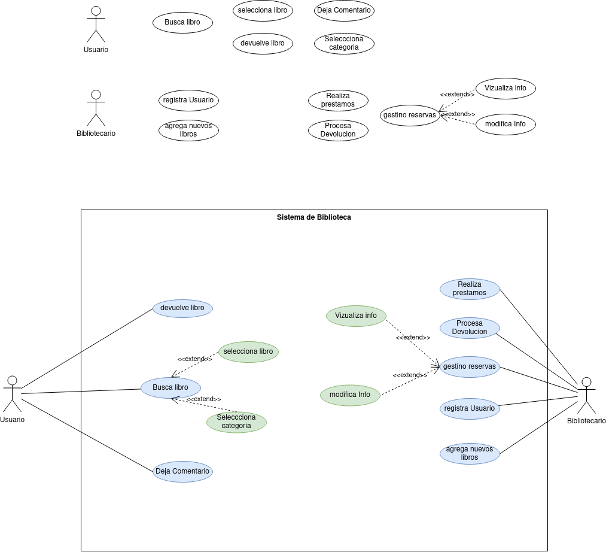

<h1> Proyecto App Gestion Bibiloteca </h1>

<h2>Documentancion sobre las diagramas de Casos de usos</h2>

<h2>Indice</h2>

- [Enunciado](#enunciado)
- [Diagrama de Cados de Uso](#diagrama-de-cados-de-uso)
- [Especificacion Actores](#especificacion-actores)
  - [Usuario](#usuario)
  - [Bibliotecario](#bibliotecario)
- [Especificacion de casos de uso](#especificacion-de-casos-de-uso)
  - [Busca libros](#busca-libros)

## Enunciado

Desarrolla un sistema de llamado Gestión de Biblioteca que permita a los bibliotecarios buscar, prestar y devolver libros en una biblioteca. El sistema debe tener una interfaz de usuario simple (Main con menú) y proporcionar funcionalidades básicas de administración de libros, como: (obtenerInformacion (identificadorLibro),prestarLibro(identificadorLibro),devolverLibro(identificadorLibro),agregarComentario(identificadorLibro),consultarComentarios(identificadorLibro),verificarDisponibilidad(identificadorLibro)). Además el sistema permitirá dar de alta/modificación/búsqueda/eliminación de usuarios y libros.

Teniendo en cuenta lo anterior, nuestro sistema debe contemplar trabajar con la siguiente información:

***<link href="https://github.com/jpexposito/docencia/tree/master/Primero/ETS/PROYECTO">Acceso a la información</link>***

## Diagrama de Cados de Uso

## Especificacion Actores

### Usuario

  Actor | Usuario |
|---|---|
| Descripción  | Persona que usa los recursos la bibloteca|
| Características  |  |
| Relaciones | se relaciona con el bibliotecario  |
| Referencias |Busca libros, selecciona libro, devuelve libro, deja comentarios, seleciona categorias|   
|  Notas |  _ |
| Autor  | Adonay Gonzalez Gutierrez |
|Fecha | 2024-01-16 |

### Bibliotecario

 Actor | Bibliotecario |
|---|---|
| Descripción  | Persona que trabaja en la biblioteca|
| Características  |  |
| Relaciones | se relaciona con el usuario  |
| Referencias |Gestiona datos de usuarios(da de alta, dar de baja etc), realiza prestamos,gestiona reservas, agrega nuevos libros, procesa devoluciones|   
|  Notas |  _ |
| Autor  | Adonay Gonzalez Gutierrez |
|Fecha | 2024-01-16 |

## Especificacion de casos de uso

### Busca libros
 |  Caso de Uso	CU | Se registra  |
  |---|---|
  | Fuentes  | <link href="https://github.com/jpexposito/docencia/tree/master/Primero/ETS/PROYECTO">***Enlace***</link> |
  | Actor  |  Usuario|
  | Descripción | Busca libros en el sistema de la biblioteca  |
  | Flujo básico | |
  | Pre-condiciones |  |  
  | Post-condiciones  | |  
  |  Requerimientos |   |
  |  Notas |  _Notas adicionales_ |
  | Autor  | Adonay González Gutiérrez |
  |Fecha | 2024-01-16 |